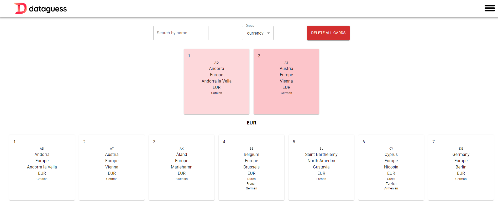

# Ülke Bilgi Uygulaması

Bu basit React uygulaması, farklı ülkelerin bilgilerini görüntülemenizi ve bu ülkeleri belirli özelliklere göre gruplandırmanızı sağlar. Uygulama, GraphQL API kullanarak ülke verilerini alır ve kullanıcıların arama yapmasını, gruplandırmasını ve seçili ülkeleri görüntülemesini sağlar.



## Özellikler

- Ülkeleri isme göre arama
- Ülkeleri belirli bir özelliğe göre gruplandırma
- Seçilen ülke bilgilerini detaylı bir şekilde görüntüleme
- Seçilen ülkeleri kartlarla görsel olarak görüntüleme
- En fazla 12 ülke seçebilme
- Ülkeleri kıtasına göre gruplandırabilme

## Kurulum

1. Bu repo'yu klonlayın:

   ```bash
   git clone https://github.com/sameterkanboz/graphql-country-client.git
   ```

2. Npm gereksinimlerimi yapın

   ```bash
   npm install
   ```

3. Projeyi localde ayağa kaldırın.

   ```bash
   npm run dev
   ```

#### Kullanılan Açık Kaynak Paketler

1. [Material UI](https://mui.com/)
2. [React Toastify](https://www.npmjs.com/package/react-toastify)
